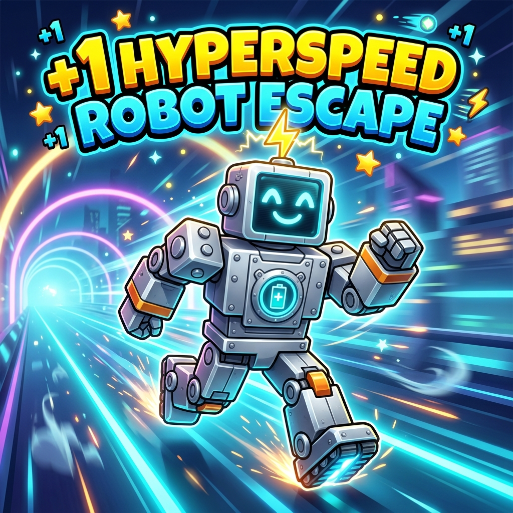

  
  <h1>+1 HyperspeedRobot Escape</h1>
  
<strong>Official Game & Website by HyperLoom Studios</strong>

> **Hello! This is the official Roblox game +1 HyperspeedRobot Escape by HyperLoom Studios:**  
> 🎮 **Roblox Game:** [Play on Roblox](https://www.roblox.com/games/111685179102810/1-HyperspeedRobot-Escape)  
> 👥 **Studio Group:** [HyperLoom Studios on Roblox](https://www.roblox.com/groups/896277589)  
> 🌐 **Official Website:** [HyperLoom Escape Portal](https://hyperloomstudios.github.io/-1hyperbot-speed-escape-escape/)  
> 
> **Ready for review, thank you!**

---

### 🚀 About The Game
**+1 HyperspeedRobot Escape** is a fast-paced sci-fi speed obstacle escape adventure on Roblox created by **HyperLoom Studios**.
- **Every Step = +1 Speed**: Accelerate through futuristic obstacle courses, dodge neon traps, and outrun the rogue AI security bots.
- **Save Checkpoints & Compete**: Race against time and friend leaderboards.
- **Active Secret Codes**: Redeem promo codes in-game for instant speed boosts, coin rewards, and exclusive robot trails.

### 🔗 Official Links
- **Roblox Game**: [https://www.roblox.com/games/111685179102810/1-HyperspeedRobot-Escape](https://www.roblox.com/games/111685179102810/1-HyperspeedRobot-Escape)
- **Roblox Group**: [https://www.roblox.com/groups/896277589](https://www.roblox.com/groups/896277589)
- **Official Website**: [https://hyperloomstudios.github.io/-1hyperbot-speed-escape-escape/](https://hyperloomstudios.github.io/-1hyperbot-speed-escape-escape/)
- **IGDB Entry**: [https://www.igdb.com/games/plus-1-hyperspeedrobot-escape](https://www.igdb.com/games/plus-1-hyperspeedrobot-escape)
- **GitHub Organization**: [https://github.com/HyperloomStudios](https://github.com/HyperloomStudios)

